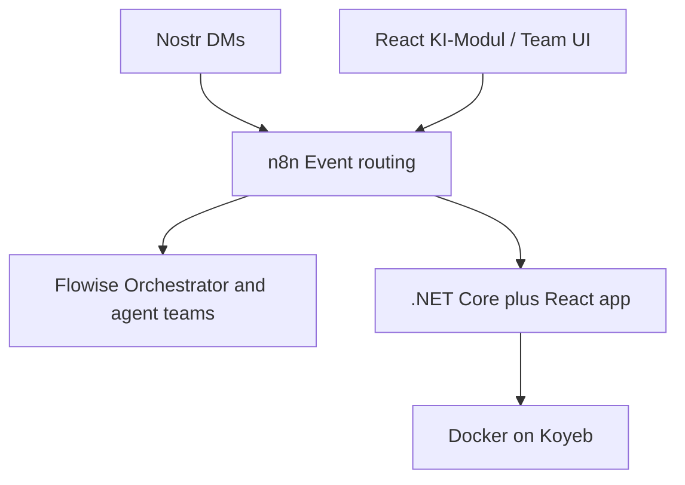

# Autonomous Agent Ecosystem (AAE)

Agent teams that build modular product features under human approval — orchestrated through n8n, reasoned in Flowise, surfaced via Nostr and a native React interface, running as a .NET + React app on Docker/Koyeb.

## Vision

AAE is a monorepo platform where specialized AI agents collaborate like a software organization: an orchestrator assigns work, domain supervisors plan within clear module boundaries, and specialists implement backend or frontend changes. Humans stay in the loop for approvals before merges and deploys.

Primary interfaces are **Nostr** (decentralized, asynchronous DMs) and a **native KI-Modul** in the web app. Both feed the same event path so agents can use the product they help build.

## System topology



n8n routes events; Flowise hosts the cognitive/orchestrator layer; the application stack is .NET Core + React, containerized for Koyeb.

## Agent model

| Role | Name / pattern | Responsibility |
|------|----------------|----------------|
| Orchestrator (CEO) | Leo | Understand vision, recruit via HR when needed, delegate to domain supervisors — never writes code |
| HR / identity smith | Helga | Create agent identity profiles (system prompts, tools, guardrails) as structured data — never writes app code or wires workflows |
| Domain supervisor | Teamleiter per domain | Plan architecture, request specialists, review quality within a module |
| Specialists | Backend / Frontend children | Implement only inside their allowed module paths |

Identity definitions live under [`agents/identities/`](agents/identities/).

## Repository layout

| Path | Role |
|------|------|
| [`frontend/`](frontend/) | React + TypeScript + Vite UI scaffold |
| [`backend/`](backend/) | ASP.NET Core (`net10.0`) API host (`Service.slnx`) |
| [`agents/`](agents/) | Agent identities and workflow JSON (n8n / Flowise) |
| [`infrastructure/`](infrastructure/) | Docker and service packaging (n8n, placeholders for flowise/nostr/webapp) |
| [`docs/`](docs/) | Architecture blueprint and process notes |

## Architecture principles

- **Static container / dynamic module integration** — agents add feature modules without rewriting core bootstrap.
- Backend modules: `Module.[Name]` under `backend/src/` (e.g. `Module.Demo`); specialists may add a `ProjectReference` on `Service` but must not modify `Program.cs` or `Core` discovery.
- Frontend modules: `frontend/src/modules/[name]` (target); global shell stays thin and registry-driven.
- Orchestration and sync: n8n as event bus; Flowise for LLM/agent flows; workflow definitions versioned in-repo where possible.

## Getting started

**Prerequisites:** Node.js (for frontend), .NET 10 SDK (for backend).

### Frontend

```cmd
cd frontend
npm install
npm run dev
```

### Backend

From the repository root:

```cmd
dotnet run --project backend\src\Service\Service.csproj
```

Solution file: [`backend/Service.slnx`](backend/Service.slnx).

### n8n

Custom image and setup notes: [`infrastructure/n8n/`](infrastructure/n8n/) (see its README). Example workflow JSON: [`agents/n8n-workflows/`](agents/n8n-workflows/).

## Further reading

| Doc | Notes |
|-----|--------|
| [`docs/aae-architectutre.html`](docs/aae-architectutre.html) | Full architecture blueprint (German UI) |
| [`docs/process/human-in-the-loop.md`](docs/process/human-in-the-loop.md) | Approval / HITL flow (German) |
| [`docs/process/organigramm.md`](docs/process/organigramm.md) | Agent hierarchy sketch (German) |
| [`docs/process/erstelle_teamleiter.md`](docs/process/erstelle_teamleiter.md) | How domain supervisors get their prompts (German) |
| [`agents/identities/leo.md`](agents/identities/leo.md) | Orchestrator system prompt |
| [`agents/identities/helga.md`](agents/identities/helga.md) | HR identity system prompt |
| [`infrastructure/n8n/README.md`](infrastructure/n8n/README.md) | n8n + Nostr community node setup (German) |

## Status

Early scaffold: frontend and backend hosts exist with backend `Module.*` auto-discovery (`Module.Demo` proof). Frontend module registry paths remain a target pattern until those folders land. Agent identities and architecture docs remain richer than the full runtime surface.
