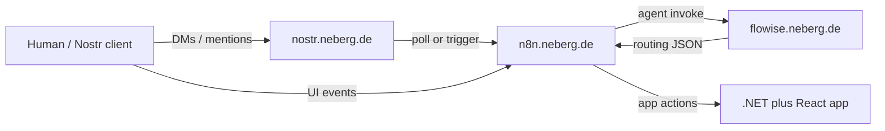
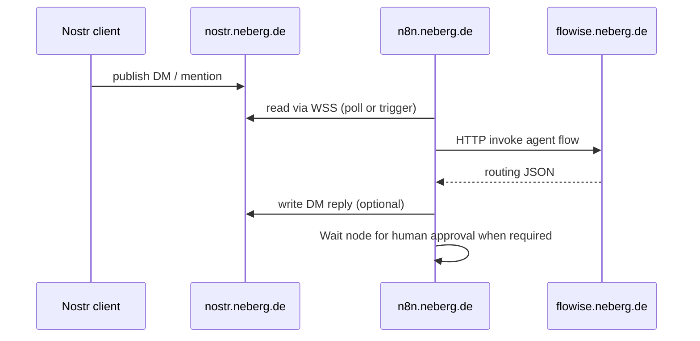

# AAE Deployed Services

Canonical hostnames and roles for the live AAE orchestration stack. Use these values when writing n8n workflows, Flowise tool configs, agent docs, and automation scripts.

## 1. Introduction and Goals

- Document the **production service endpoints** under `*.neberg.de`.
- Give workflow authors stable URLs (HTTP and WebSocket) without digging through Dockerfiles.
- Keep packaging details in [`infrastructure/`](../infrastructure/); this file is the runtime address book.

Primary consumers: n8n workflow JSON, Flowise flows, agent identity docs, HITL process notes, and future CI/CD hooks.

## 2. System Scope and Context



Clarifies which hostname owns which hop in the AAE event path.

| Host | Role | Protocol |
|------|------|----------|
| [`nostr.neberg.de`](https://nostr.neberg.de) | AAE Nostr relay (interface ingress) | HTTPS / **WSS** |
| [`n8n.neberg.de`](https://n8n.neberg.de) | Event routing, webhooks, Wait/HITL | HTTPS |
| [`flowise.neberg.de`](https://flowise.neberg.de) | LLM / agent orchestration (Leo teams) | HTTPS |

Trust boundary: these hosts are the shared runtime for AAE. Secrets (API keys, Nostr `nsec`, Flowise credentials) stay in each service’s credential store — never in this repo’s docs or workflow JSON placeholders.

## 3. Building Blocks

| Block | Public URL | Repo packaging | Responsibility |
|-------|------------|----------------|----------------|
| Nostr relay | `https://nostr.neberg.de` · `wss://nostr.neberg.de` | [`infrastructure/nostr/`](../infrastructure/nostr/) | Persist and fan out Nostr events (DMs, mentions, kind metadata) for AAE clients and n8n Nostr nodes |
| n8n | `https://n8n.neberg.de` | [`infrastructure/n8n/`](../infrastructure/n8n/) | Schedule/poll, webhooks, route JSON between Nostr, Flowise, and the app; HITL pause/resume |
| Flowise | `https://flowise.neberg.de` | [`infrastructure/flowise/`](../infrastructure/flowise/) | Host orchestrator and agent-team flows; return structured routing payloads for n8n |

Image bases (from Dockerfiles):

| Service | Base image |
|---------|------------|
| Nostr | `scsibug/nostr-rs-relay:0.10.0` (container port `8080`) |
| n8n | `n8nio/n8n:latest` + baked-in `n8n-nodes-nostrobots@1.2.1` |
| Flowise | `flowiseai/flowise:3.1.1` |

The combined web app image lives under [`infrastructure/webapp/`](../infrastructure/webapp/) and is **not** listed as a `*.neberg.de` host above until a public URL is assigned.

## 4. Runtime View

### Typical Nostr → agent path



Clarifies that **n8n** is the only service that should call Flowise and write back to the relay in the default topology.

### Values for workflow scripts

Copy these into nodes, env files, or sticky notes — do not hardcode public relays when the AAE relay is intended.

```text
NOSTR_RELAY_HTTPS=https://nostr.neberg.de
NOSTR_RELAY_WSS=wss://nostr.neberg.de
N8N_BASE_URL=https://n8n.neberg.de
FLOWISE_BASE_URL=https://flowise.neberg.de
```

**n8n Nostr nodes** (community package `n8n-nodes-nostrobots`): set the relay field to `wss://nostr.neberg.de` (comma-separate additional public relays only if deliberately multi-homing).

**Flowise HTTP nodes / webhooks from n8n:** base URL `https://flowise.neberg.de` plus the flow-specific prediction path from the Flowise UI.

**Inbound webhooks into n8n:** `https://n8n.neberg.de/webhook/...` (path from the Webhook node). Prefer production webhook URLs from the live instance, not localhost.

Example workflow JSON in-repo: [`agents/n8n-workflows/`](../agents/n8n-workflows/). Older examples may still list `wss://relay.damus.io`, `wss://nos.lol`, etc. — prefer `wss://nostr.neberg.de` for AAE-owned traffic.

## 5. Crosscutting Concepts

- **Configuration model:** Hostnames are stable; container image tags and community-node versions change in `infrastructure/*/Dockerfile`.
- **Auth:** n8n and Flowise use their own login / API keys. Nostr uses keypair credentials in n8n (`Nostrobots API`), not HTTP Basic on the relay URL.
- **Persistence:** Nostr relay expects a mounted SQLite volume (`./data` → `/usr/src/app/db` per Dockerfile comments). n8n/Flowise persistence is host/platform-managed outside this doc.
- **Observability:** Use each product’s UI (n8n executions, Flowise logs, relay process logs). No shared AAE metrics endpoint yet.

## 6. Risks and Limitations

- Example workflows may still point at third-party relays; AAE DM reliability depends on using `wss://nostr.neberg.de`.
- NIP-04 DMs leak metadata (sender/recipient public); see [`infrastructure/n8n/README.md`](../infrastructure/n8n/README.md).
- Flowise prediction paths and n8n webhook IDs are instance-specific — document them in the workflow sticky notes when created, not only here.
- Do not commit `nsec`, Flowise API keys, or n8n credentials. Test key material notes: [`docs/nostr-test-account.md`](nostr-test-account.md) (keep out of public forks if sensitive).

## 7. Glossary

| Term | Meaning |
|------|---------|
| Relay | Nostr WebSocket server that stores/forwards events |
| Event routing | n8n’s role as bus between interfaces and Flowise/app |
| Routing JSON | Structured payload agents emit so n8n can act (message, delegate, HITL) |
| HITL | Human-in-the-loop pause via n8n Wait + approval UI |

## References

- Packaging: [`infrastructure/README.md`](../infrastructure/README.md)
- n8n setup: [`infrastructure/n8n/README.md`](../infrastructure/n8n/README.md)
- Topology overview: [`README.md`](../README.md)
- HITL process: [`docs/process/human-in-the-loop.md`](process/human-in-the-loop.md)
