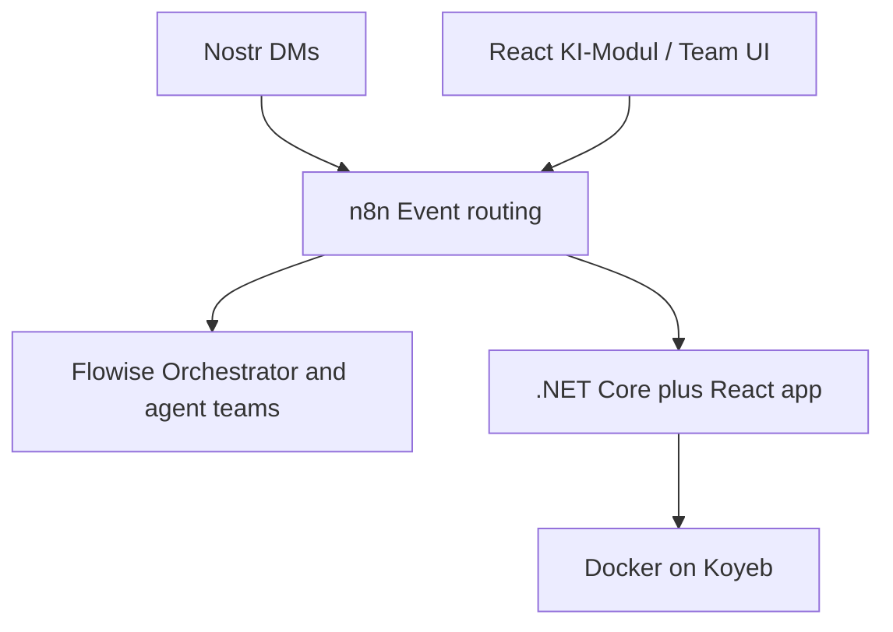

# AAE Root README Implementation Plan

> **For agentic workers:** REQUIRED SUB-SKILL: Use superpowers:subagent-driven-development (recommended) or superpowers:executing-plans to implement this plan task-by-task. Steps use checkbox (`- [ ]`) syntax for tracking.

**Goal:** Replace the empty root `README.md` with an English hub document that orients contributors and stakeholders, then points to deeper docs.

**Architecture:** Single-file hub README (no new packages). Vision-first narrative, Mermaid topology, agent model summary, repo map, target-pattern architecture principles, minimal local quickstart, and curated further-reading links. Does not duplicate or replace `docs/aae-architectutre.html`.

**Tech Stack:** Markdown + Mermaid; content derived from existing docs and repo layout (React/Vite frontend, ASP.NET Core `net10.0` backend, n8n Docker image).

**Spec:** `docs/superpowers/specs/2026-07-21-aae-readme-design.md`

## Global Constraints

- Language: English only in root `README.md`
- Shape: Hub README — summarize + link; do not port the full architecture HTML
- Vision-first: lead with intended system; one short early-stage status note
- Scope: modify root `README.md` only — do not change `frontend/README.md` or rewrite German process docs
- No secrets: never copy keys from `docs/nostr-test-account.md`
- Module paths that do not exist yet must be labeled as **target pattern**
- Tone: direct technical English; no marketing fluff
- Windows host: use CMD for shell steps; no PowerShell/bash scripts

---

## File structure

| File | Responsibility |
|------|----------------|
| `README.md` (repo root) | Sole deliverable — English hub entry point |
| `docs/aae-architectutre.html` | Read-only source for vision/topology (filename typo preserved in links) |
| `docs/process/*.md` | Read-only sources for HITL / org / teamleiter pointers |
| `agents/identities/*` | Read-only source for Leo / Helga / supervisor template |
| `frontend/package.json` | Read-only source for npm scripts |
| `backend/src/Service/Service.csproj` | Read-only source for `dotnet run` target |
| `infrastructure/n8n/README.md` | Linked n8n setup notes |

---

### Task 1: Author root README

**Files:**
- Modify: `README.md` (currently empty)

**Interfaces:**
- Consumes: Spec outline and Mermaid from `docs/superpowers/specs/2026-07-21-aae-readme-design.md`
- Produces: Complete hub `README.md` with all nine outline sections

- [ ] **Step 1: Confirm prerequisites from the repo**

Run from repo root:

```cmd
cmd /c "dir README.md & dir /b frontend\package.json & dir /b backend\src\Service\Service.csproj & dir /b docs\aae-architectutre.html & dir /b docs\process & dir /b agents\identities & dir /b infrastructure\n8n\README.md"
```

Expected: all listed paths exist; root `README.md` is present (may be empty).

- [ ] **Step 2: Write the full hub README**

Replace the entire contents of `README.md` with exactly the following (outer fence uses four backticks so inner Mermaid/cmd fences stay intact):

````markdown
# Autonomous Agent Ecosystem (AAE)

Agent teams that build modular product features under human approval — orchestrated through n8n, reasoned in Flowise, surfaced via Nostr and a native React interface, running as a .NET + React app on Docker/Koyeb.

## Vision

AAE is a monorepo platform where specialized AI agents collaborate like a software organization: an orchestrator assigns work, domain supervisors plan within clear module boundaries, and specialists implement backend or frontend changes. Humans stay in the loop for approvals before merges and deploys.

Primary interfaces are **Nostr** (decentralized, asynchronous DMs) and a **native KI-Modul** in the web app. Both feed the same event path so agents can use the product they help build.

## System topology



n8n routes events; Flowise hosts the cognitive/orchestrator layer; the application stack is .NET Core + React, containerized for Koyeb.

## Agent model

| Role | Name / pattern | Responsibility |
|------|----------------|----------------|
| Orchestrator (CEO) | Leo | Understand vision, recruit via HR when needed, delegate to domain supervisors — never writes code |
| HR / identity smith | Helga | Create agent identity profiles (system prompts, tools, guardrails) as structured data — never writes app code or wires workflows |
| Domain supervisor | Teamleiter per domain | Plan architecture, request specialists, review quality within a module |
| Specialists | Backend / Frontend children | Implement only inside their allowed module paths |

Identity definitions live under [`agents/identities/`](agents/identities/).

## Repository layout

| Path | Role |
|------|------|
| [`frontend/`](frontend/) | React + TypeScript + Vite UI scaffold |
| [`backend/`](backend/) | ASP.NET Core (`net10.0`) API host (`Service.slnx`) |
| [`agents/`](agents/) | Agent identities and workflow JSON (n8n / Flowise) |
| [`infrastructure/`](infrastructure/) | Docker and service packaging (n8n, placeholders for flowise/nostr/webapp) |
| [`docs/`](docs/) | Architecture blueprint and process notes |

## Architecture principles

Target pattern (blueprint ahead of full runtime modules):

- **Static container / dynamic module integration** — agents add feature modules without rewriting core bootstrap.
- Backend modules: `AAE.Modules.[Name]` (target); specialists must not modify core host bootstrap such as `Program.cs`.
- Frontend modules: `frontend/src/modules/[name]` (target); global shell stays thin and registry-driven.
- Orchestration and sync: n8n as event bus; Flowise for LLM/agent flows; workflow definitions versioned in-repo where possible.

## Getting started

**Prerequisites:** Node.js (for frontend), .NET 10 SDK (for backend).

### Frontend

```cmd
cd frontend
npm install
npm run dev
```

### Backend

From the repository root:

```cmd
dotnet run --project backend\src\Service\Service.csproj
```

Solution file: [`backend/Service.slnx`](backend/Service.slnx).

### n8n

Custom image and setup notes: [`infrastructure/n8n/`](infrastructure/n8n/) (see its README). Example workflow JSON: [`agents/n8n-workflows/`](agents/n8n-workflows/).

## Further reading

| Doc | Notes |
|-----|--------|
| [`docs/aae-architectutre.html`](docs/aae-architectutre.html) | Full architecture blueprint (German UI) |
| [`docs/process/human-in-the-loop.md`](docs/process/human-in-the-loop.md) | Approval / HITL flow (German) |
| [`docs/process/organigramm.md`](docs/process/organigramm.md) | Agent hierarchy sketch (German) |
| [`docs/process/erstelle_teamleiter.md`](docs/process/erstelle_teamleiter.md) | How domain supervisors get their prompts (German) |
| [`agents/identities/leo.md`](agents/identities/leo.md) | Orchestrator system prompt |
| [`agents/identities/helga.md`](agents/identities/helga.md) | HR identity system prompt |
| [`infrastructure/n8n/README.md`](infrastructure/n8n/README.md) | n8n + Nostr community node setup (German) |

## Status

Early scaffold: frontend and backend hosts exist; agent identities and architecture docs are richer than the running application surface. Treat module paths above as the intended pattern until those folders land in code.
````

Write only the inner Markdown to `README.md` (do not include the outer four-backtick fence markers).

- [ ] **Step 3: Confirm the file is non-empty and contains required headings**

Run:

```cmd
cmd /c "findstr /B /C:\"# Autonomous Agent Ecosystem\" README.md & findstr /C:\"## Vision\" /C:\"## System topology\" /C:\"## Agent model\" /C:\"## Repository layout\" /C:\"## Architecture principles\" /C:\"## Getting started\" /C:\"## Further reading\" /C:\"## Status\" README.md"
```

Expected: title line and all eight `##` section headings match.

- [ ] **Step 4: Commit**

```cmd
git add README.md
git commit -m "Add English hub README for AAE monorepo."
```

On Windows, if the shell injects a broken commit trailer, write the message to a temp file and use `git commit -F <file>` via a small `.cmd` helper (same pattern used for the design-spec commit).

---

### Task 2: Verify links, commands, and spec coverage

**Files:**
- Modify: none (verification only); fix `README.md` only if a check fails

**Interfaces:**
- Consumes: `README.md` from Task 1
- Produces: Confirmed checklist against the design spec

- [ ] **Step 1: Verify every relative link target exists**

Run from repo root:

```cmd
cmd /c "dir agents\identities & dir frontend & dir backend & dir agents & dir infrastructure & dir docs & dir docs\aae-architectutre.html & dir docs\process\human-in-the-loop.md & dir docs\process\organigramm.md & dir docs\process\erstelle_teamleiter.md & dir agents\identities\leo.md & dir agents\identities\helga.md & dir infrastructure\n8n\README.md & dir backend\Service.slnx & dir agents\n8n-workflows"
```

Expected: every `dir` succeeds (exit code 0).

- [ ] **Step 2: Spot-check no secrets leaked**

Run:

```cmd
cmd /c "findstr /I /C:nsec /C:npub /C:6aaf105c README.md"
```

Expected: no matches (exit code 1 from `findstr` is success for this check).

- [ ] **Step 3: Confirm out-of-scope files untouched**

Run:

```cmd
cmd /c "git status -sb & git diff --name-only"
```

Expected: only `README.md` changed for this work (plus any already-committed plan/spec files from earlier). `frontend/README.md` must not appear as modified.

- [ ] **Step 4: Manual Mermaid sanity check**

Open `README.md` in the editor preview (or GitHub later) and confirm the topology diagram shows six nodes with edges: Nostr→n8n, UI→n8n, n8n→Flowise, n8n→App, App→Host.

- [ ] **Step 5: Commit verification fixes if any**

If Step 1–4 required edits to `README.md`:

```cmd
git add README.md
git commit -m "Fix hub README link and content verification issues."
```

If no edits were needed, skip this commit.

---

## Spec coverage self-review

| Spec requirement | Task |
|------------------|------|
| Dual audience hub | Task 1 content |
| Vision-first + status note | Task 1 Vision + Status |
| English | Global Constraints + Task 1 |
| Mermaid topology | Task 1 + Task 2 Step 4 |
| Agent model + identities link | Task 1 |
| Repo layout | Task 1 |
| Architecture principles as target pattern | Task 1 |
| Getting started commands | Task 1 |
| Further reading (German noted) | Task 1 |
| No secrets | Task 2 Step 2 |
| Root README only | Task 2 Step 3 |
| Path verification | Task 2 Step 1 |

## Placeholder scan

No TBD/TODO placeholders; full README body is inlined in Task 1 Step 2 inside a four-backtick fence.
