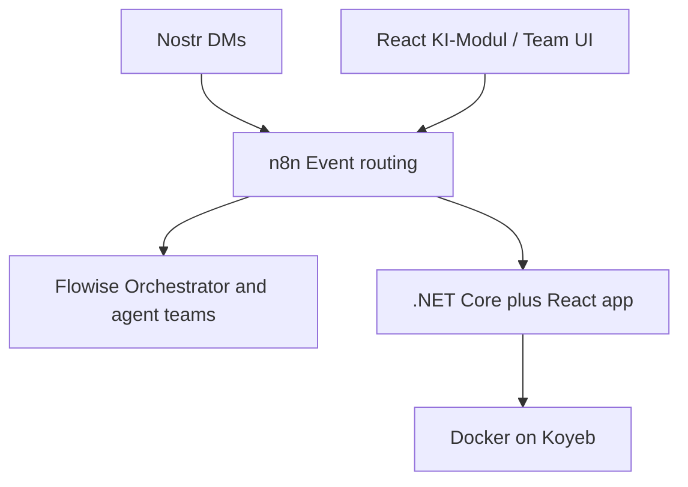

# Design: AAE Root README (Hub)

**Date:** 2026-07-21  
**Status:** Approved for implementation planning  
**Output:** Replace empty root `README.md` with an English hub document

## Goal

Create a single root `README.md` that serves both new contributors and architects/stakeholders: vision-first orientation, enough local setup to run the scaffolds, and links into deeper docs — without duplicating the architecture blueprint.

## Decisions

| Topic | Choice |
|-------|--------|
| Audience | Dual: onboarding + architecture pointers |
| Vision vs. code | Vision-first; one short early-stage status note |
| Language | English |
| Shape | Hub README (Approach 1) |
| Scope | Root `README.md` only |
| Out of scope | Rewriting German process docs; replacing `docs/aae-architectutre.html`; changing `frontend/README.md` |

## Document outline

1. **Title + tagline** — Autonomous Agent Ecosystem  
2. **Vision** — Agent teams build modular product features under human approval; interfaces via Nostr and native React KI-Modul  
3. **System topology** — Mermaid flowchart: Nostr / React UI → n8n → Flowise and .NET/React application (Docker → Koyeb)  
4. **Agent model** — Leo (orchestrator), Helga (HR/identities), domain supervisors → specialists; link `agents/identities/`  
5. **Repository layout** — `frontend/`, `backend/`, `agents/`, `infrastructure/`, `docs/`  
6. **Architecture principles** — Static container / dynamic module integration; agents limited to `AAE.Modules.*` / `src/modules/*`; core bootstrap off-limits  
7. **Getting started** — Node + .NET 10; frontend `npm install` / `npm run dev` from `frontend/`; backend `dotnet run --project backend/src/Service/Service.csproj` from repo root (solution file: `backend/Service.slnx`); n8n via `infrastructure/n8n/` + its README  
8. **Further reading** — Architecture HTML, HITL, organigram, teamleiter process, n8n setup; note German where applicable  
9. **Status** — Early scaffold; blueprint ahead of runtime completeness  

## Content rules

- Source of truth for vision/topology/agents: `docs/aae-architectutre.html`, `docs/process/*`, `agents/identities/*`
- Source of truth for commands/paths: actual repo files (`frontend/package.json`, `backend/Service.slnx`, `infrastructure/n8n/`)
- Describe module paths that do not exist yet as **target pattern**, not as present reality
- No secrets (do not copy keys from `docs/nostr-test-account.md`)
- Summarize German docs; do not translate them wholesale into the README
- Tone: direct technical English; no marketing fluff

## Mermaid topology (intended)

## Verification

- Empty root README replaced with the hub content above
- Mermaid block is valid
- Every linked relative path exists in the repo
- Reader can skim vision and start frontend/backend from the same page

## Non-goals

- Implementing missing modules, Flowise workflows, or full Koyeb deploy docs beyond pointers
- Repo-wide README sweep for every package
- Committing application secrets or test Nostr keys into documentation
