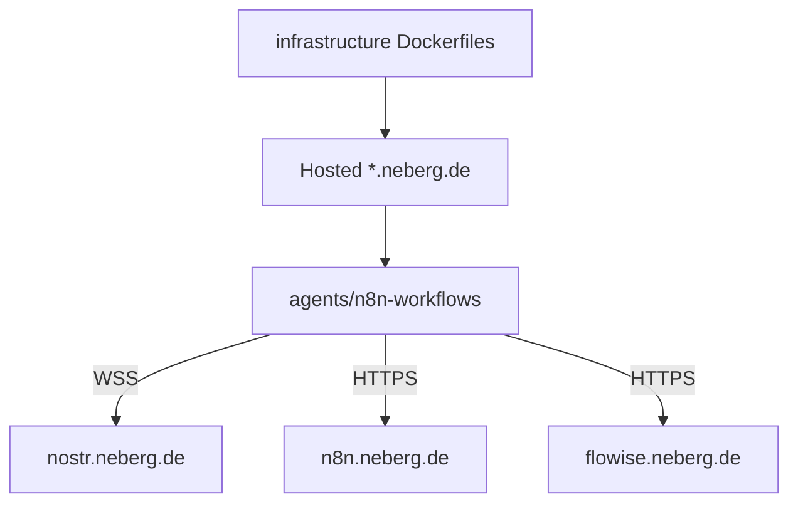

# Infrastructure services

## Integration Guide

### What it does

Docker packaging for the AAE side services: Nostr relay, n8n (with Nostr community nodes), Flowise, and the combined .NET + React webapp image. Live hostnames for workflow authors are listed in [`docs/deployed-services.md`](../docs/deployed-services.md).

### Prerequisites

- Docker (build and run)
- Access to the deployed instances when configuring workflows (not required to build images)

### Setup

Build from each service directory (examples):

```cmd
cd infrastructure\n8n
docker build -t aae-n8n .

cd ..\flowise
docker build -t aae-flowise .

cd ..\nostr
docker build -t aae-nostr .
```

Point n8n Nostr nodes and scripts at the deployed relay:

- UI / health: `https://nostr.neberg.de`
- Relay WebSocket: `wss://nostr.neberg.de`
- n8n UI: `https://n8n.neberg.de`
- Flowise UI: `https://flowise.neberg.de`
- Web app: `https://ai.neberg.de`

### Configuration

| Service | Directory | Notes |
|---------|-----------|--------|
| Nostr | [`nostr/`](nostr/) | Mount DB volume; optional `config.toml` |
| n8n | [`n8n/`](n8n/) | Image preinstalls `n8n-nodes-nostrobots`; see [`n8n/README.md`](n8n/README.md) |
| Flowise | [`flowise/`](flowise/) | Thin pin of `flowiseai/flowise:3.1.1` |
| Webapp | [`webapp/`](webapp/) | Multi-stage frontend + backend publish; live host `https://ai.neberg.de` |

### Common mistakes

- Using public relays (`nos.lol`, `damus`, …) in AAE workflows instead of `wss://nostr.neberg.de`
- Committing credentials or `nsec` values into workflow JSON
- Calling Flowise from agents directly instead of via n8n routing

## Implementation Details

### Runtime flow



Shows packaging → deploy → workflow binding; hostnames are the contract for scripts and docs.

### Key artifacts

| Path | Responsibility |
|------|----------------|
| [`nostr/Dockerfile`](nostr/Dockerfile) | `nostr-rs-relay` image, port 8080, volume hints |
| [`n8n/Dockerfile`](n8n/Dockerfile) | n8n + `n8n-nodes-nostrobots@1.2.1` + `@noble/hashes` |
| [`flowise/Dockerfile`](flowise/Dockerfile) | Flowise 3.1.1 pin |
| [`webapp/Dockerfile`](webapp/Dockerfile) | React build + .NET 10 publish into one runtime image |
| [`docs/deployed-services.md`](../docs/deployed-services.md) | Canonical public URLs |

### Extension points

- Bump image tags in the Dockerfiles when upgrading n8n / Flowise / relay
- Add new hosted services by creating `infrastructure/<name>/` and registering the hostname in `docs/deployed-services.md`

### Limitations

- Deploy/platform config (Koyeb, TLS, volumes) is outside this repo folder; hostnames are in [`docs/deployed-services.md`](../docs/deployed-services.md)

### References

- Source: this directory’s Dockerfiles
- Workflows: [`agents/n8n-workflows/`](../agents/n8n-workflows/)
- Deployed hosts: [`docs/deployed-services.md`](../docs/deployed-services.md)
